# Project Schedule Baseline & Critical Path Analysis: PSA Task Manager

**Project:** Multi-Tenant Task Management SaaS with Integrated ML Prediction  
**Document Version:** 1.0.0  
**Methodology:** Critical Path Method (CPM) with Agile Sprints  
**Status:** Executed & Verified  

---

## 1. Project Milestones Summary

| Milestone ID | Milestone Name | Planned Target | Actual Date | Status | Major Gate Criteria |
| :---: | :--- | :---: | :---: | :---: | :--- |
| **M1** | Project Initialization & Architecture Approval | Day 1 | Day 1 | Complete | 3-tier architecture, pooled multi-tenancy, and tech stack confirmed. |
| **M2** | EDA, Model Training & Benchmarking Complete | Day 3 | Day 3 | Complete | Desharnais dataset cleaned, MdMRE evaluated, champion model persisted. |
| **M3** | FastAPI ML Microservice Live & Tested | Day 5 | Day 5 | Complete | Sub-50ms inference, 10k-run Monte Carlo, `X-Internal-Token` auth validated via pytest. |
| **M4** | Multi-Tenant Node.js Backend & Security Core | Day 8 | Day 8 | Complete | Tenant discriminator schema, JWT rotation, `tenantScope.js`, audit logging operational. |
| **M5** | Next.js Frontend Dashboard & Kanban Client | Day 11 | Day 11 | Complete | Tenant-aware UI, live ML duration feedback, Monte Carlo distribution graphs, SuperAdmin panel. |
| **M6** | Security Invariant & Integration Test Suite | Day 13 | Day 13 | Complete | 100% pass on 6 security invariants (IDOR, parameter stripping, audit logging) and 21 automated tests. |
| **M7** | Project Management Documentation Baseline | Day 14 | Day 14 | Complete | Complete `/docs` repository deliverables finalized. |

---

## 2. Activity Dependency Network & Duration Estimates

Durations are calculated using the Program Evaluation and Review Technique (PERT) weighted average formula:
$$T_e = \frac{O + 4M + P}{6}$$
Where $O = \text{Optimistic}$, $M = \text{Most Likely}$, $P = \text{Pessimistic}$ duration in working days.

| Activity ID | Task Description | Predecessor(s) | $O$ | $M$ | $P$ | Expected ($T_e$) | Critical Path? |
| :---: | :--- | :---: | :---: | :---: | :---: | :---: | :---: |
| **A1** | Requirements Engineering & Security Threat Modeling | None | 1.0 | 1.5 | 2.0 | 1.5 | **YES** |
| **A2** | Dataset Acquisition, EDA & Skew Preprocessing | A1 | 1.0 | 1.5 | 2.0 | 1.5 | **YES** |
| **A3** | ML Algorithm Benchmarking & Model Export | A2 | 1.0 | 2.0 | 3.0 | 2.0 | **YES** |
| **A4** | FastAPI Service & Internal Token Authentication | A3 | 1.0 | 1.5 | 2.0 | 1.5 | **YES** |
| **A5** | Monte Carlo Probabilistic Forecasting Engine | A4 | 0.5 | 1.0 | 1.5 | 1.0 | **YES** |
| **A6** | MongoDB Multi-Tenant Schemas & Compound Indices | A1 | 1.0 | 1.5 | 2.0 | 1.5 | NO (Float = 4.5d) |
| **A7** | Tenant Isolation Middleware & Security Hardening | A6 | 1.0 | 2.0 | 3.0 | 2.0 | NO (Float = 2.5d) |
| **A8** | Node.js Backend API Controllers & ML Client | A5, A7 | 2.0 | 3.0 | 4.0 | 3.0 | **YES** |
| **A9** | Next.js Frontend Framework & Auth Context | A8 | 1.0 | 1.5 | 2.0 | 1.5 | **YES** |
| **A10** | Kanban Board, Task Modals & Forecast UI | A9 | 1.5 | 2.5 | 3.5 | 2.5 | **YES** |
| **A11** | SuperAdmin Fleet Governance Console | A10 | 0.5 | 1.0 | 1.5 | 1.0 | NO (Float = 1.0d) |
| **A12** | Automated Security Invariant & Integration Tests | A8, A10 | 1.0 | 2.0 | 3.0 | 2.0 | **YES** |
| **A13** | Documentation, Walkthrough & Viva Preparation | A12 | 1.0 | 1.5 | 2.0 | 1.5 | **YES** |

---

## 3. Critical Path Analysis (CPM)

```mermaid
graph LR
    A1["A1: Requirements & Threat Model (1.5d)"] --> A2["A2: Dataset EDA & Prep (1.5d)"]
    A2 --> A3["A3: ML Benchmarking & Export (2.0d)"]
    A3 --> A4["A4: FastAPI Service & Auth (1.5d)"]
    A4 --> A5["A5: Monte Carlo Engine (1.0d)"]
    A5 --> A8["A8: Backend APIs & ML Client (3.0d)"]
    
    A1 -.-> A6["A6: Schemas & Indices (1.5d)"]
    A6 -.-> A7["A7: Isolation Middleware (2.0d)"]
    A7 -.-> A8
    
    A8 --> A9["A9: Frontend Core & Auth (1.5d)"]
    A9 --> A10["A10: Kanban & Forecast UI (2.5d)"]
    A10 --> A12["A12: Automated Security Tests (2.0d)"]
    A10 -.-> A11["A11: SuperAdmin Console (1.0d)"]
    A11 -.-> A12
    A12 --> A13["A13: Final /docs & Walkthrough (1.5d)"]

    style A1 fill:#b91c1c,stroke:#991b1b,color:#fff
    style A2 fill:#b91c1c,stroke:#991b1b,color:#fff
    style A3 fill:#b91c1c,stroke:#991b1b,color:#fff
    style A4 fill:#b91c1c,stroke:#991b1b,color:#fff
    style A5 fill:#b91c1c,stroke:#991b1b,color:#fff
    style A8 fill:#b91c1c,stroke:#991b1b,color:#fff
    style A9 fill:#b91c1c,stroke:#991b1b,color:#fff
    style A10 fill:#b91c1c,stroke:#991b1b,color:#fff
    style A12 fill:#b91c1c,stroke:#991b1b,color:#fff
    style A13 fill:#b91c1c,stroke:#991b1b,color:#fff
```

### 3.1 Critical Path Calculation
The Critical Path represents the longest sequence of dependent activities with **zero total float**:
$$\text{Critical Path} = \mathbf{A1 \rightarrow A2 \rightarrow A3 \rightarrow A4 \rightarrow A5 \rightarrow A8 \rightarrow A9 \rightarrow A10 \rightarrow A12 \rightarrow A13}$$

* **Total Expected Critical Path Duration:**
  $$1.5 + 1.5 + 2.0 + 1.5 + 1.0 + 3.0 + 1.5 + 2.5 + 2.0 + 1.5 = \mathbf{18.0\text{ working days}}$$
* **Non-Critical Path Float:**
  * Path $\{A6, A7\}$ has $4.5$ days of total float, allowing database schema design to occur concurrently with ML research without jeopardizing the milestone delivery.
  * SuperAdmin management UI ($A11$) possesses $1.0$ day of free float prior to test suite consolidation.

---

## 4. Risk Buffers & Schedule Contingencies

To protect the critical path against unforeseen disruptions, two explicit buffers were incorporated:
1. **Feeding Buffer (FB-1):** A 1.0-day buffer inserted between ML model export ($A3$) and backend integration ($A8$) to accommodate hyperparameter re-tuning if initial validation metrics failed to satisfy the $MdMRE \le 35\%$ threshold.
2. **Project Buffer (PB):** A 2.0-day contingency buffer positioned before final sign-off ($A13$) to absorb unexpected security vulnerability remediations and frontend rendering edge cases.

---

## 5. Earned Value Analysis (EVA) Summary

At the current stage of project execution (Milestone 7):
* **Planned Value (PV):** $100\%$ of scheduled work packages.
* **Earned Value (EV):** $100\%$ of functional deliverables verified via automated test suites.
* **Schedule Performance Index (SPI):**
  $$\text{SPI} = \frac{\text{EV}}{\text{PV}} = \frac{1.0}{1.0} = 1.00$$
* **Cost / Effort Performance Index (CPI):** Execution completed within allocated compute and time bounds with zero scope creep.
